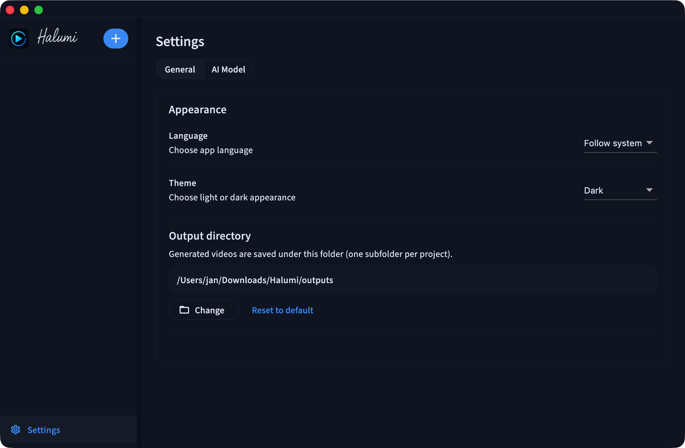

# Halumi

基于 Flutter 的 AI 视频生成桌面工作台。

[English](README.md)

## 功能
- 多模型/多提供方管理（OpenAI Sora 2、Google Veo、阿里万相、字节即梦、快手可灵）。
- 项目化工作流：新建、重命名、删除作品。
- 提示词 + 参考图（单图/多图随模型而定）。
- 模型感知的参数选择：画面比例、分辨率、时长。
- 生成进度与状态、保存路径提示、快速打开输出目录。
- 本地设置：语言（中文/English）、主题（浅色/深色/跟随系统）、输出目录。
- 使用 Hive 本地持久化项目与设置。

## 支持平台
- macOS
- Windows

## 本地运行
1. 安装 Flutter，并执行 `flutter pub get`。
2. 启动桌面端：
   - `flutter run -d macos`
   - `flutter run -d windows`

## macOS 打包
1. 构建 macOS release：
   - `flutter build macos --release`
2. 应用包路径：
   - `build/macos/Build/Products/Release/Halumi.app`
3. 生成 DMG 安装包：
   - `hdiutil create -volname Halumi -srcfolder build/macos/Build/Products/Release/Halumi.app -ov -format UDZO build/macos/Halumi.dmg`

DMG 输出路径为 `build/macos/Halumi.dmg`。

## Windows 打包（Inno Setup）
1. 构建 Windows release：
   - `flutter build windows --release`
2. 使用 Inno Setup 的 ISCC 编译安装包：
   - `iscc windows/installer/halumi.iss`

安装包输出到 `build/installer`。

## 使用说明
1. 打开「设置」->「AI 模型」添加配置。
2. 在侧边栏新建作品。
3. 输入提示词，按模型要求选择参考图。
4. 选择比例/分辨率/时长，点击「生成」。

## Provider 说明
- Sora 2：API Key；可选 Base URL/模型 ID。
- Veo：OAuth Token、Project ID、Location/Region；可选 Storage URI。
- 万相：API Key；可选模型 ID。
- 即梦/可灵：API Key + Secret Key；至少需要一张参考图。
- 是否支持多图及数量上限由模型能力决定，界面会自动限制。

## 开发
- `flutter analyze`
- `flutter test`
